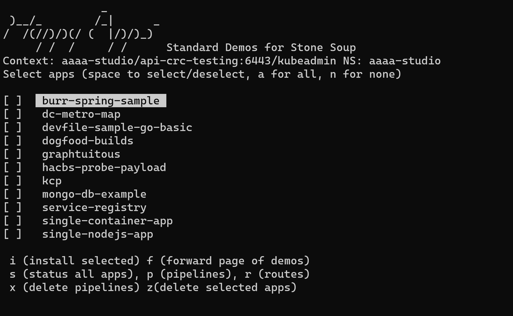

# appstudio-e2e-demos

This repo contains a selection of Stone Studio Demos. 
The Demos consist of the Application and Components needed to bootstrap a demo.
For demos which do not have devfiles. 

Run `./menu.sh` to try it on any cluster you are connected to.
This has been tested on CRC infra-deployments, as well as Stone Soup Staging.

Note: As per the infra-deployments examples, you need to set `MY_QUAY_USER` and `MY_QUAY_TOKEN` to enable push images to your personal registry.


 
Demos can be added in the subdirectory called demos in a structure like the following.

```
tree demos/dc-metro-map/
demos/dc-metro-map/ 
├── app
│   └── application.yaml
└── components
    ├── billing-service.yaml
    └── map-service.yaml
```    

`app` --- app studio application definition (optional- if missing, one will be created from the directory name, easy peasy)

`components` --- component definitions 
 
`devfiles` --- externally provided devfiles if original repo doesn't have one (optional)

Demos are grouped into separate directories. Use "f" to paginate between them. 